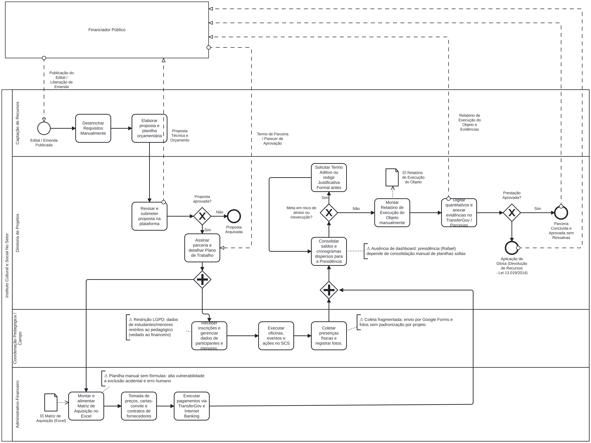

# B1 · Modelo do processo atual (BPMN)

| Data | Versão | Descrição | Autor(es) |
| :--- | :--- | :--- | :--- |
| 17/09/2026 | 1.0 | Modelagem inicial do processo AS-IS em BPMN e mapeamento de gargalos operacionais | Rodrigo Henrique e Vinicius Vieira |
| 17/09/2026 | 1.1 | Inclusão da cadeia de evidências de ER, rastreabilidade bidirecional e segregação LGPD | Rodrigo Henrique |
| 17/09/2026 | 1.2 | Participantes por data conforme a ata; nomenclatura das características alinhada à seção 2; capacidades previstas no lugar de identificadores ainda não atribuídos; figura com legenda numerada | Vinicius Vieira |

| Campo | Informação |
| :--- | :--- |
| **Código do Artefato** | B1 |
| **Atividade de ER** | Representação (apoiada em Elicitação e Descoberta / Análise e Consenso) |
| **Rastreabilidade** | OE01, OE02, CP1, CP2, CP7, CP8, Lei 13.019/2014 (MROSC) |

---

## 1. Evidência da atividade de Engenharia de Requisitos

Para comprovar a conformidade metodológica da modelagem, o processo seguiu a cadeia estruturada de execução e rastreabilidade:

* **Atividade:** Elicitação, Descoberta e Representação de Processos de Negócio.
* **Datas de Execução:** 08/09/2026 (presencial no SCS) e 15/09/2026 (reunião remota de alinhamento).
* **Participantes:**
  * *Pelo Instituto:* Maria Clara e Maria Eduarda, do núcleo pedagógico (08/09 e 15/09); a coordenação administrativo-financeira e de execução e a área de projetos (15/09).
  * *Pela Equipe:* Vinicius Vieira, Maria Eduarda Marques e Daniel Batista em 08/09; Vinicius Vieira, Daniel Batista e Caio Martins em 15/09.
* **Técnicas Empregadas:** Entrevista semiestruturada, observação direta das instalações e modelagem de processos, representada na notação BPMN 2.0.
* **Evidências Primárias Auditáveis:**
  * Ata formal da reunião presencial de 08/09: [ata da reunião presencial de 08/09/2026](../gestao/atas/2026-09-08-reuniao-presencial-instituto.md).
  * Registros brutos: notas manuscritas da equipe em 08/09 (não houve gravação); gravação e transcrição automática de 15/09, com consentimento, arquivadas no Drive restrito da equipe conforme a [política de registro](../gestao/atas/index.md#politica-de-registro-acesso-e-publicacao).
* **Resultado Produzido:** Diagrama BPMN 2.0 representativo do fluxo AS-IS com identificação de 6 gargalos críticos.
* **Requisitos Derivados:** As dores mapeadas sustentam diretamente as histórias de usuário **HU-01**, **HU-02**, **HU-03**, **HU-04**, **HU-05** e **HU-06**.

---

## 2. Diagrama do processo atual

O diagrama abaixo ilustra a cadeia operacional do Instituto No Setor. A piscina externa representa o órgão concedente (*Financiador Público*), comunicando-se via fluxos de mensagem; a piscina interna desdobra a atuação das quatro áreas operacionais.

<figure markdown>
  
  <figcaption>Figura 4 – Modelo do processo atual (AS-IS) do Instituto No Setor. Fonte: elaborada pelos autores.</figcaption>
</figure>

---

## 3. Descrição operacional das macrofases


```

[1. Captação & Proposta] ➔ [2. Plano de Trabalho] ➔ [3. Execução Paralela] ➔ [4. Consolidação & Riscos] ➔ [5. Prestação de Contas]

```

### 3.1 Captação e submissão da proposta
* O processo se inicia quando o concedente publica um edital ou disponibiliza emenda parlamentar.
* A equipe de **Captação de Recursos** realiza o destrinchamento manual das regras do chamamento e redige a proposta com pesquisa de preços de mercado.
* A **Diretoria de Projetos** analisa, aprova e envia a proposta na plataforma oficial de convênios. Em caso de indeferimento, a proposta é arquivada.

### 3.2 Planejamento e desdobramento de metas
* Com a proposta aprovada, formaliza-se a celebração da parceria e a homologação do Plano de Trabalho formal.
* As metas pactuadas são subdivididas na planilha-template da organização conforme três origens normativas: metas do edital, metas do projeto e metas próprias do Instituto.
* A partir da homologação, um gateway paralelo (`+`) dispara a execução simultânea das áreas finalística e de suporte financeiro.

### 3.3 Execução paralela, pedagógica e financeira
* **Trilha A — Coordenação Pedagógica / Campo:**
  * Recepção de inscrições e triagem cadastral. Na prática corrente, o acesso aos dados nominais é restrito à equipe pedagógica, entre outras razões pela presença de menores de idade atendidos no SCS.
  * Condução de oficinas, ações urbanas e eventos.
  * Coleta de listas de presença físicas em papel e fotos capturadas em aparelhos telefônicos particulares dos educadores, submetidas via formulários avulsos no Google Forms por projeto.
* **Trilha B — Administrativo-Financeiro:**
  * Preenchimento da Matriz de Aquisição manual no Excel para acompanhamento orçamentário.
  * Realização de tomada de preços, cartas-convite e contratos de prestação de serviços.
  * Liquidação e pagamento de despesas por meio do *TransferGov* e *Internet Banking*.

### 3.4 Consolidação gerencial e mitigação de inexecução
* As duas trilhas convergem em um gateway paralelo de junção (`+`) na Diretoria de Projetos.
* A Diretoria consolida saldos financeiros e status de execução para prestar contas à Presidência do Instituto.
* **Ponto de Decisão (Risco de Inexecução):**
  * Se for constatado risco de descumprimento de prazos ou quantitativos, a organização atua tempestivamente solicitando **Termo Aditivo** formal de prorrogação/remanejamento ou redigindo **Justificativa Prévia fundamentada**.
  * Se o cronograma estiver regular, prossegue-se diretamente para a montagem dos comprovantes.

### 3.5 Relatório do objeto e prestação de contas
* A equipe despende esforço intensivo resgatando arquivos dispersos em celulares e formulários para estruturar manualmente o **Relatório de Execução do Objeto**.
* Os quantitativos consolidados e relatórios tabulares são digitados no sistema governamental (*TransferGov* / *Parcerias*).
* **Avaliação pelo Financiador:**
  * *Aprovado:* Parceria homologada com sucesso e arquivamento formal.
  * *Rejeitado / Sem Justificativa:* Aplicação de **glosa**, com devolução dos valores impugnados, nos termos da Lei 13.019/2014 e de seu regulamento; o art. 64, §1º, exige justificativa para meta descumprida.

---

## 4. Rastreabilidade dos gargalos às capacidades previstas

Para demonstrar a utilidade prática do modelo no projeto, cada ponto de atrito observado no processo atual foi mapeado diretamente para uma capacidade prevista no CyberSetor:

| Gargalo Operacional Identificado | Impacto no Cenário AS-IS | Requisito / Solução no CyberSetor |
| :--- | :--- | :--- |
| **G01: Destrinchamento manual de editais** | Perda de prazos contratuais e requisitos esquecidos. | **HU-01:** Cadastro padronizado de requisitos com indicador, aferição e prazos. |
| **G02: Descentralização de demandas por e-mail/WhatsApp** | Sobrecarga de analistas e falta de visibilidade sobre pendências. | **Candidato, sem história derivada:** abertura e acompanhamento de chamados ou ordens de serviço, pedido em 15/09. **HU-02** cobre apenas responsável, setor e prazo por requisito. |
| **G03: Listas físicas em papel e fotos dispersas** | Alto esforço de resgate documental e risco de extravio. | **HU-03 e HU-04:** Registro de atividades por tipo de objeto e vinculação direta de evidências às metas. |
| **G04: Contatos retidos em celulares particulares** | Falta de histórico de participantes e vulnerabilidade à LGPD. | **HU-06:** Base única de pessoas com histórico e governança de dados pessoais. |
| **G05: Ausência de visão unificada para a Presidência** | Dependência de planilhas frágeis em Excel para consultar status. | **Candidato, sem história derivada:** painel consolidado para a presidência, demanda de 15/09 relatada em nome do presidente e ainda não validada com ele nem priorizada. |
| **G06: Risco iminente de glosa na prestação de contas** | Obrigatoriedade legal de ressarcimento por ausência de justificativa prévia. | **HU-05:** Geração automatizada do Relatório de Execução do Objeto com exigência de justificativa em metas parciais. |

