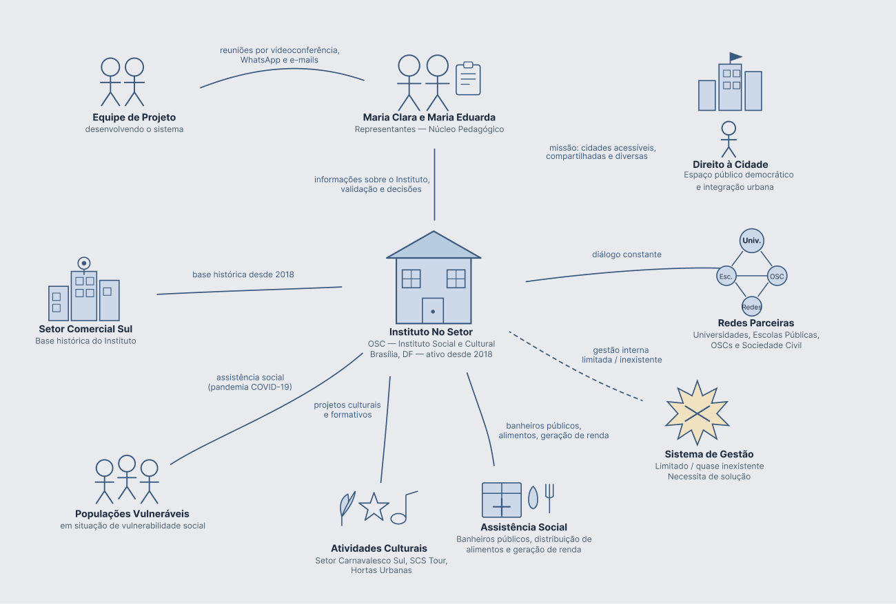
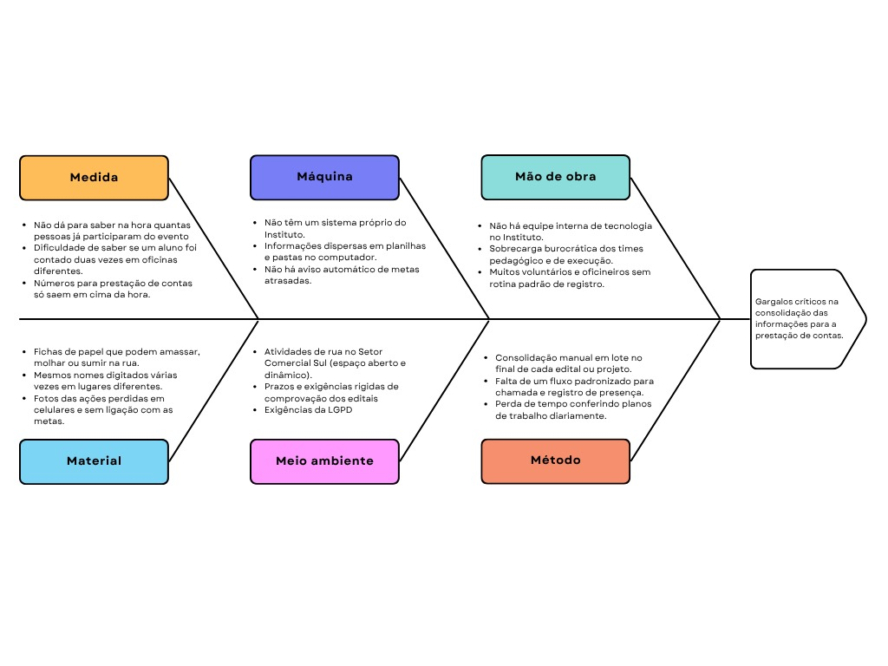
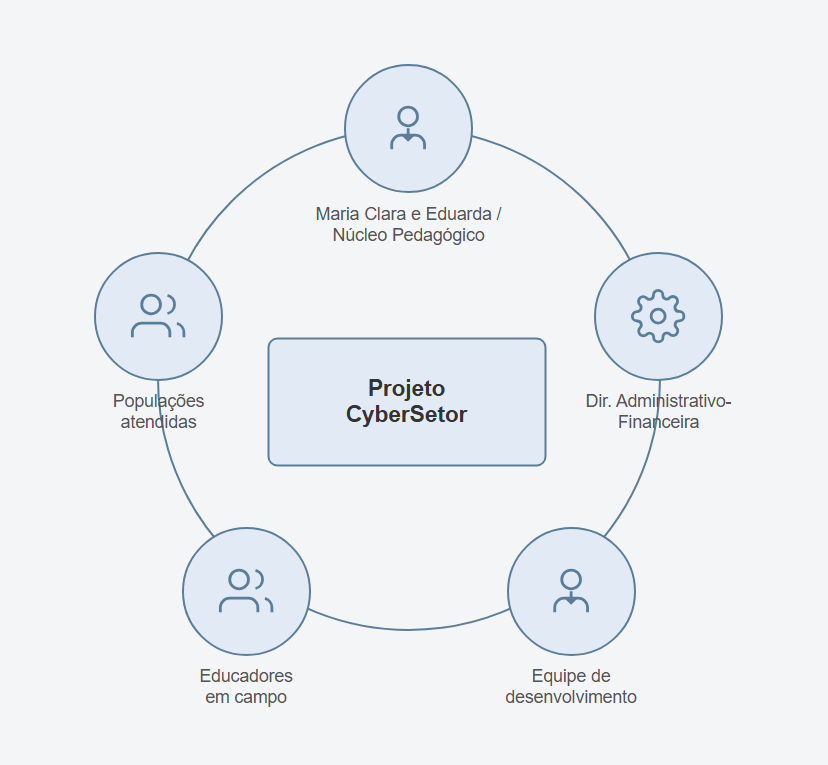

# 1. Cenário atual do cliente e do negócio

| Data | Versão | Descrição | Autor |
|---|---|---|---|
| 01/09/2026 | 1.0 | Versão inicial | Equipe CyberSetor |
| 05/09/2026 | 1.1 | Revisão das seções 1.4, 1.5 e 1.7 | Equipe CyberSetor |
| 14/09/2026 | 1.2 | Identificação institucional das representantes do Instituto nas seções 1.1, 1.5 e 1.6; mapa de stakeholders alinhado à validação por área da seção 7.3.1 | Vinicius Vieira e Maria Eduarda Marques |
| 17/09/2026 | 1.3 | Segmentação de clientes alinhada ao escopo da seção 2.3: registro de presença e carga horária no lugar da emissão de certificado | Equipe CyberSetor |

## 1.1 Identificação do Cliente/Parceiro

- **Nome:** Instituto No Setor

- **Tipo:** Organização da Sociedade Civil (OSC) que atua como Instituto Social e Cultural

- **Representantes:** Maria Clara e Maria Eduarda, ambas do **núcleo pedagógico do Instituto**. (Não confundir com Maria Eduarda Marques, integrante da equipe CyberSetor — ver seção 7.1.)

- **Forma de contato:** Reuniões periódicas por videoconferência, canal no WhatsApp e e-mails.

- **Vínculo com o projeto:** Clientes reais e responsáveis por nos fornecerem informações sobre o Instituto, auxiliar a tomar decisões, avaliar e validar as entregas feitas durante o desenvolvimento.

## 1.2 Introdução ao Negócio e Contexto

O Instituto Cultural e Social No Setor é uma organização brasileira que atua há cerca de oito anos na defesa do direito à cidade e na ocupação democrática do espaço público. Focado em promover a convivência urbana e a integração, o Instituto tem como objetivo construir projetos culturais, sociais e formativos que valorizem as pessoas e os territórios. A organização tem sua raiz e base histórica no Setor Comercial Sul (SCS), no centro de Brasília, onde iniciou suas atividades em 2018. Hoje, atua de forma muito mais ampla, expandindo suas ações para diferentes regiões do Distrito Federal e do Brasil, em diálogo constante com redes, universidades, escolas públicas e organizações da sociedade civil. A missão da instituição é fortalecer cidades mais acessíveis, compartilhadas, diversas e vivas a partir das pessoas que vivenciam esses territórios diariamente.

Ao longo de sua trajetória, o No Setor registrou uma evolução profunda em seu escopo de atuação: o que começou como uma ocupação cultural, com iniciativas de sucesso como o Setor Carnavalesco Sul, SCS Tour e hortas urbanas, transformou-se em uma plataforma de mobilização e cuidado. Impulsionado pelas urgências da pandemia de Covid-19, o Instituto adaptou-se para atender populações em situação de vulnerabilidade social, passando a gerir banheiros públicos, distribuir alimentos e promover campanhas de geração de renda. Essa experiência consolidou a metodologia atual do coletivo, que une criação artística, assistência social e construção coletiva da cidade. A execução de suas iniciativas é sustentada, em parte, por recursos captados em editais públicos de fomento à cultura e por parcerias institucionais, o que implica compromissos formais de execução e prestação de contas periódicas das metas pactuadas. Apesar da amplitude dessas iniciativas, a gestão interna do Instituto permanece apoiada em controles manuais e ferramentas genéricas, sem um sistema que integre o registro das atividades à apuração de resultados.

## 1.3 Rich Picture

<figure markdown>
  
  <figcaption>Figura 1 – Rich Picture do Cenário Operacional do Instituto No Setor. Fonte: elaborada pelos autores.</figcaption>
</figure>

O diagrama ilustra o ecossistema do Instituto No Setor, destacando a articulação entre as representantes pedagógicas, os educadores em campo no Setor Comercial Sul (SCS) e os públicos atendidos (populações vulneráveis e comunidade). Evidencia-se a dependência de recursos via editais públicos e parcerias, cuja prestação de contas é atualmente prejudicada pela fragmentação dos controles manuais e planilhas eletrônicas, ponto crítico de tensão onde a solução CyberSetor atuará como elo integrador.

## 1.4 Identificação da Oportunidade ou Problema

<figure markdown>
  
  <figcaption>Figura 2 – Diagrama de Ishikawa. Fonte: elaborada pelos autores.</figcaption>
</figure>

A consolidação das informações para a prestação de contas do Instituto No Setor enfrenta atualmente gargalos críticos, resultado de uma coleta de dados fragmentada e da dependência excessiva de controles manuais em planilhas eletrônicas. Esse cenário gera uma desarticulação no fluxo de informações, que vai desde a inscrição de participantes em oficinas até a entrega do relatório final, obrigando a equipe a realizar uma consolidação manual exaustiva de registros e evidências de campo a cada ciclo. Tal retrabalho burocrático não apenas sobrecarrega a equipe administrativa e eleva o risco de inconsistências nos dados, como também inviabiliza o acompanhamento em tempo real do atingimento das metas pactuadas em editais.

## 1.5 Desafios do Projeto

- Operação em Ambiente Dinâmico e Aberto: Desenvolver uma aplicação web leve e resiliente a oscilações de conectividade móvel, permitindo que educadores registrem presenças e informações diretamente nos espaços públicos do Setor Comercial Sul (SCS) sem interromper a dinâmica das ações.

- Transferência e Autonomia Operacional: Projetar uma arquitetura de baixo custo e manutenção simplificada, assegurando que uma organização sem equipe técnica interna de TI opere, faça cadastros e exporte seus relatórios com total independência após o encerramento do projeto acadêmico.

- Adequação Regulatória e Proteção de Dados (LGPD): Implementar fluxos de consentimento e tratamento responsável de informações cadastrais, resguardando a privacidade de populações em vulnerabilidade social sem burocratizar a adesão às oficinas e atendimentos.

- Gestão de Escopo no Prazo Semestral: Priorizar estritamente o núcleo de valor do MVP (apuração de metas e unificação de dados) dentro do ciclo acadêmico, postergando módulos secundários que demandem complexidade contábil ou integrações excedentes

## 1.6 Mapa de Stakeholders

Os principais stakeholders do projeto são: Maria Clara e Maria Eduarda, do núcleo pedagógico do Instituto, que atuam como interlocutoras do cliente na gestão das atividades pedagógicas; os educadores em campo, que realizam a inscrição, o registro de presença e a coleta de evidências em campo; a Diretoria de Projetos e Captação de Recursos e a Área Administrativo-Financeira, que respondem pelas metas, indicadores e relatórios de prestação de contas; as populações atendidas e a comunidade em geral, que são os beneficiários das ações culturais e de assistência; e a equipe de desenvolvimento, responsável por construir e integrar o fluxo único de dados com aderência à realidade operacional do Instituto. As responsabilidades específicas de validação por área e funcionalidade estão detalhadas na [seção 7.3.1](7-equipe-e-cliente.md#731-area-competente-por-funcionalidade).

<figure markdown>
  
  <figcaption>Figura 3 – Mapa de stakeholders do projeto CyberSetor. Fonte: elaborada pelos autores.</figcaption>
</figure>

| Stakeholder | Relação com a solução | Interesse principal | Influência |
|---|---|---|---|
| Maria Clara e Maria Eduarda, do núcleo pedagógico do Instituto | Representantes do cliente | Validar o plano de trabalho, atividades e acompanhamento pedagógico (ver §7.3.1) | Alta |
| Educadores em campo | Usuários operacionais diretos | Validar fluxos de inscrição, registro de presenças e evidências em campo (ver §7.3.1) | Alta |
| Diretoria de Projetos e Área Administrativo-Financeira | Usuários internos de gestão | Validar regras de metas, parâmetros de aferição e relatórios de prestação de contas (ver §7.3.1) | Alta |
| Populações atendidas e Comunidade | Usuários finais | Participar das ações formativas, culturais e de assistência com organização | Média |
| Equipe de desenvolvimento | Responsável pela construção do produto | Entregar uma solução viável e de qualidade | Alta |

## 1.7 Segmentação de Clientes

- **1. Coordenação e Gestores da OSC**: Integrantes do núcleo pedagógico e administrativo do Instituto. Interagem configurando metas, cadastrando projetos e gerando relatórios consolidados no painel administrativo. Necessitam de visibilidade contínua sobre metas em risco e automação na prestação de contas para editais.

- **2. Educadores, Artistas e Voluntários de Campo:** Profissionais que conduzem oficinas formativas e mutirões no SCS. Interagem pelo navegador móvel realizando chamadas digitais em lote e anexando evidências (fotos/atas). Necessitam de agilidade no registro presencial e emissão simplificada de declarações de atuação.

- **3. Participantes de Oficinas e Cursos Formativos**: Jovens e adultos matriculados em turmas contínuas (ex.: oficinas de música, fotografia, serigrafia e arte urbana). Interagem acessando páginas públicas de inscrição por link/QR Code e confirmando seus dados. Necessitam de um canal acessível de inscrição e do registro confiável da própria presença e carga horária.

- **4. Comunidade e Pessoas em Situação de Vulnerabilidade:** Indivíduos atendidos em ações de cuidado, assistência social e hortas comunitárias no SCS. Não interagem diretamente com o sistema; seus atendimentos são registrados pelos facilitadores de campo. Necessitam de acolhimento ágil sem burocracia documental e garantia de sigilo de seus dados.

- **5. Público de Eventos e Ocupações Culturais**: Frequentadores de ações abertas no território (ex.: SCS Tour, feiras culturais e intervenções artísticas). Interagem via formulários rápidos de adesão ou contagem agregada de público. Beneficiam-se da ampliação da oferta cultural sustentada pela comprovação de alcance do Instituto.
