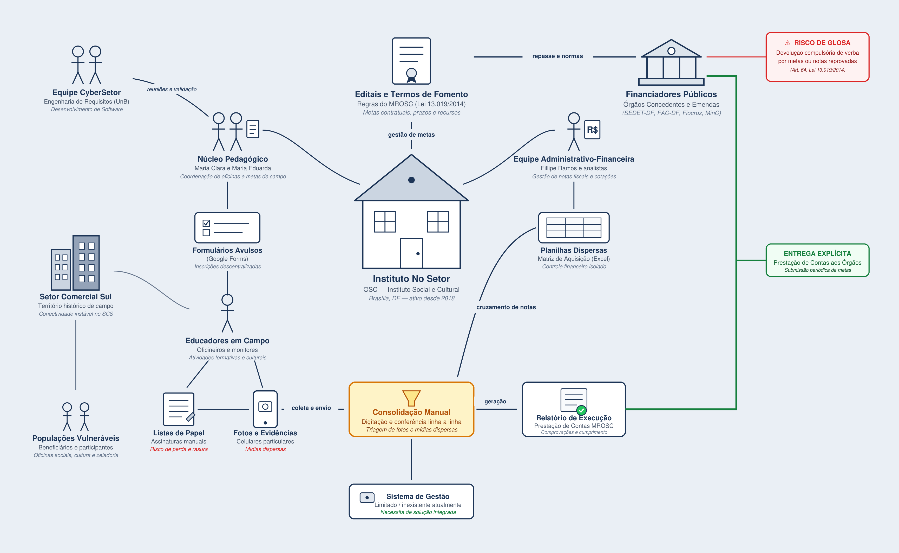
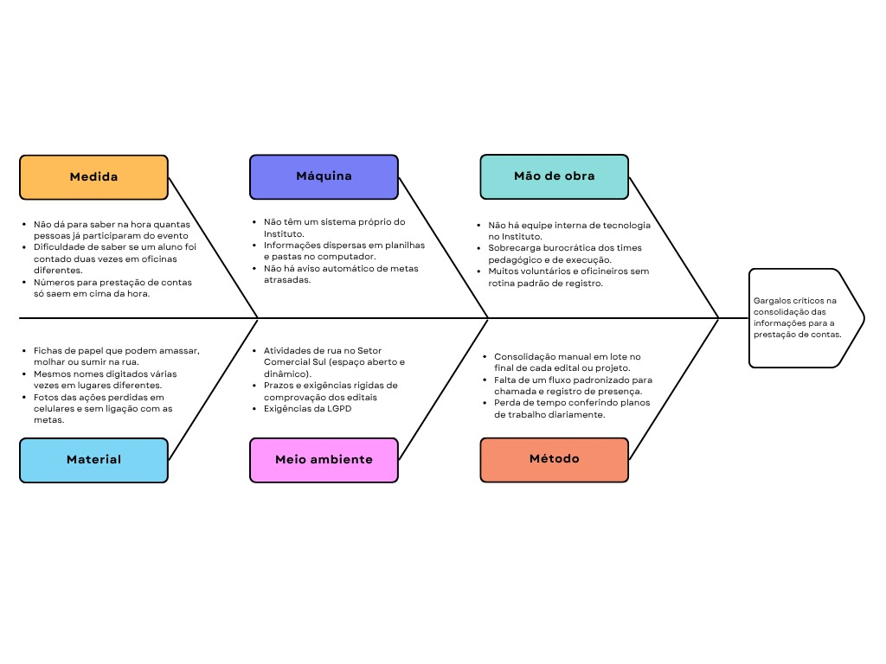
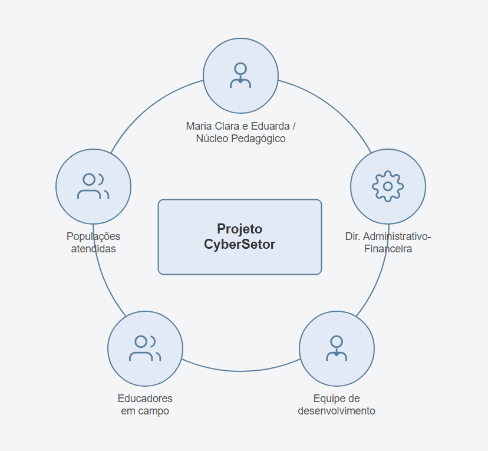

# 1. Cenário atual do cliente e do negócio

| Data | Versão | Descrição | Autor(es) |
| :--- | :--- | :--- | :--- |
| 01/09/2026 | 1.0 | Versão inicial | Equipe CyberSetor |
| 05/09/2026 | 1.1 | Revisão das seções 1.4, 1.5 e 1.7 | Equipe CyberSetor |
| 14/09/2026 | 1.2 | Identificação institucional das representantes do Instituto nas seções 1.1, 1.5 e 1.6; mapa de stakeholders alinhado à validação por área da seção 7.3.1 | Vinicius Vieira e Maria Eduarda Marques |
| 17/09/2026 | 1.3 | Segmentação de clientes alinhada ao escopo da seção 2.3: registro de presença e carga horária no lugar da emissão de certificado | Equipe CyberSetor |
| 17/09/2026 | 1.4 | Dimensionamento do problema, matriz de interesse e poder com estratégias de engajamento, distinção entre usuário, titular e beneficiário, aprofundamento da área administrativo-financeira e heterogeneidade dos editais | Rodrigo Henrique e Daniel Batista |
| 28/09/2026 | 1.5 | Rich Picture refeito com os oito componentes do fluxo operacional (financiadores públicos, editais e termos de fomento, projetos e metas, formulários avulsos, campo com listas e fotos, área administrativo-financeira, consolidação manual e entrega dos relatórios com risco de glosa), detalhados na seção 1.3 | Daniel Batista |
| 30/09/2026 | 1.6 | Atualização do Rich Picture e mapa de stakeholders com papéis identificados na reunião de 08/09 (Diretoria de Projetos, Captação de Recursos, ausência de RH, demais setores operacionais e regimes de financiadores) | Equipe CyberSetor |

---

## 1.1 Identificação do Cliente/Parceiro

* **Nome Institucional:** Instituto Cultural e Social No Setor (Instituto No Setor).
* **Natureza Jurídica:** Organização da Sociedade Civil (OSC) sem fins lucrativos, atuando como instituto social e cultural regido pelas normas do Marco Regulatório das Organizações da Sociedade Civil — MROSC (Lei Federal nº 13.019/2014).
* **Interlocutores e Estrutura de Contato:**
  * *Presidência:* Rafael, a quem cabe a visão consolidada das operações e das parcerias.
  * *Núcleo pedagógico:* Maria Clara e Maria Eduarda. **Não confundir com Maria Eduarda Marques, integrante da equipe CyberSetor — ver seção 7.1.**
  * *Coordenação e rotina administrativo-financeira:* Fillipe Ramos.
  * *Área de projetos:* Fran.
* **Canais Formais de Interação:** Reuniões periódicas presenciais e remotas, canal institucional no WhatsApp e correio eletrônico.
* **Papel no Projeto:** Clientes e especialistas de domínio, responsáveis por descrever a rotina de trabalho, prover amostras de instrumentos de gestão, priorizar funcionalidades do produto e validar incrementalmente as entregas.

---

## 1.2 Introdução ao Negócio e Contexto

O Instituto Cultural e Social No Setor atua há cerca de oito anos na ocupação democrática do espaço público e na defesa do direito à cidade. Com fundação e sede histórica no Setor Comercial Sul (SCS), região central de Brasília, a organização converte áreas públicas em palcos de convivência cidadã, articulação comunitária e profissionalização.

Ao longo de sua trajetória, o Instituto ampliou seu escopo: o trabalho iniciado com eventos culturais e ocupações artísticas (como o Setor Carnavalesco Sul e o SCS Tour) expandiu-se, sobretudo a partir da pandemia de Covid-19, para ações de assistência humanitária, zeladoria urbana, capacitação técnica e promoção dos direitos humanos para populações em extrema vulnerabilidade.

Para sustentar essas intervenções, o Instituto articula parcerias com a administração pública nas esferas distrital e federal (como SEDET-DF, FAC-DF, Fiocruz e Ministério da Cultura), além de emendas parlamentares. A formalização desses convênios impõe deveres legais estritos de prestação de contas. Entretanto, a gestão dos dados operacionais e financeiros ainda repousa em controles manuais desconexos e planilhas eletrônicas frágeis, expondo o Instituto ao risco de inexecução e sanções financeiras.

---

## 1.3 Rich Picture e Mapeamento do Fluxo do Problema

<figure markdown>
  
  <figcaption>Figura 1 – Rich Picture do Cenário Operacional do Instituto No Setor. Fonte: elaborada pelos autores.</figcaption>
</figure>

O Rich Picture sintetiza visualmente a articulação institucional e o fluxo operacional do Instituto No Setor, explicitando os oito componentes centrais do ecossistema e os gargalos críticos que justificam a concepção da solução de software:

1. **Financiadores Públicos:** Órgãos concedentes e fontes de emendas parlamentares (SEDET-DF, FAC-DF, Fiocruz e Ministério da Cultura), operando sob diferentes regimes e regulamentos, responsáveis pelos repasses financeiros e pela fiscalização das metas contratuais pactuadas.
2. **Editais e Termos de Fomento:** Instrumentos jurídicos disciplinados pelo Marco Regulatório das Organizações da Sociedade Civil — MROSC (Lei Federal nº 13.019/2014), que fixam metas quantitativas, prazos de execução, limites orçamentários e regras de prestação de contas.
3. **Diretoria de Projetos e Captação de Recursos:** Stakeholder crítica que concentra a captação de emendas, a gestão da prestação de contas e a resposta a emergências, desdobrando as obrigações dos termos de fomento em planos de trabalho de campo para os projetos do Instituto.
4. **Formulários Avulsos:** Instrumentos descentralizados (como Google Forms) operados pelo núcleo pedagógico (Maria Clara e Maria Eduarda) para inscrições de turmas e cadastro de participantes, desconectados de um banco centralizado.
5. **Setores Operacionais, Listas de Presença e Evidências:** Educadores, oficineiros e demais setores operacionais (marcenaria, lavanderia, oficina de estilografia e atendimento a pessoas em situação de rua) realizam as atividades formativas com populações vulneráveis no SCS sob oscilações de rede, coletando assinaturas em listas de presença físicas de papel (sujeitas a perda, rasgos e umidade) e fotografias/vídeos comprobatórios em aparelhos celulares pessoais dispersos.
6. **Equipe Administrativo-Financeira:** Conduzida por Fillipe Ramos e analistas, gerencia cotações de preços, notas fiscais e alimentação manual da Matriz de Aquisição em arquivos isolados do Excel, sem sincronia em tempo real com as evidências pedagógicas. Devido à ausência de uma área de Recursos Humanos, o setor acumula também controles dessas rotinas.
7. **Consolidação Manual (Gargalo Operacional):** Ponto crítico de estrangulamento onde convergem listas de papel, fotos de celulares e planilhas financeiras. Exige digitação manual, triagem de mídias e conferência linha a linha entre presenças e rubricas orçamentárias.
8. **Relatórios de Execução, Entrega Explícita e Risco de Glosa:** Etapa final de consolidação dos relatórios de cumprimento do objeto para submissão formal aos órgãos financiadores. A lentidão e a fragilidade do processo manual expõem a organização ao severo **Risco de Glosa** (art. 64 da Lei 13.019/2014), com possibilidade de rejeição de contas e exigência de devolução compulsória de recursos públicos.

O fluxo em que os gargalos se originam está modelado em notação BPMN na página [B1 · Modelo do processo atual](../requisitos/b1-bpmn-processo-atual.md).

---

## 1.4 Identificação e Dimensionamento Empírico do Problema

<figure markdown>
  
  <figcaption>Figura 2 – Diagrama de Ishikawa. Fonte: elaborada pelos autores.</figcaption>
</figure>

O processo atual gera descompasso entre a execução prática no SCS e a comprovação exigida pelos órgãos concedentes. A ausência de um sistema integrado centralizado impõe os seguintes gargalos mensuráveis:

* **Projetos em paralelo:** seis projetos foram identificados nominalmente na conversa de 15/09, pelos códigos 061 a 065 e 068, este último paralisado. O total em execução a cada momento será apurado na visita de observação.
* **Volume de Planilhas Dispersas:** Cada projeto exige uma planilha de acompanhamento de metas e uma **Matriz de Aquisição** exclusiva em Excel. São dezenas de arquivos desconexos em unidades individuais do Google Drive e em discos rígidos locais, sem fórmulas automáticas consolidadas e vulneráveis a exclusões acidentais de registros.
* **Atividades e participantes:** oficinas formativas — entre elas serigrafia, fotografia, música e arte urbana — convivem com eventos urbanos abertos, cada tipo com exigência de comprovação distinta. A contagem de oficinas por mês e de participantes por etapa é objeto da visita de observação.
* **Evidências acumuladas:** a apuração de um edital reúne fotografias e vídeos gravados nos telefones particulares dos oficineiros e listas físicas de frequência, sujeitas a perda, rasura e umidade. O volume por edital ainda não foi medido.
* **Consolidação manual:** antes de cada prazo de prestação de contas, analistas e coordenadores fazem a triagem das evidências e o cruzamento com a contabilidade, linha a linha. O tempo gasto é descrito pelo Instituto como um dos maiores custos do ciclo, e sua medição entra na visita de observação.
* **Frequência de Inconsistências e Risco Crítico de Glosa:** A falta de visibilidade em tempo real faz com que metas em atraso só sejam percebidas ao final do cronograma. Isso impede a solicitação tempestiva de **Termos Aditivos** ou justificativas formais prévias, acarretando o risco de **glosa** (devolução compulsória de recursos ao erário público sob correção monetária, nos termos do art. 64 da Lei 13.019/2014).
* **Heterogeneidade de Editais e Plataformas:** Convivência paralela com regulamentos de órgãos distintos (SEDET-DF, FAC-DF, Fiocruz), cada qual operando com plataformas próprias (*TransferGov*, sistema *Parcerias* e *Internet Banking*) e formatos documentais próprios.

---

## 1.5 Desafios do Projeto

* **Operação de Campo e Resiliência sem Conexão:** Disponibilizar uma interface leve e intuitiva para que oficineiros registrem presenças e capturem evidências no SCS sob oscilações severas de rede móvel, com capacidade de armazenamento em cache no navegador e envio posterior com tratamento de duplicidade no servidor.
* **Governança de Dados Pessoais e LGPD:** Segregar o acesso aos dados nominais e cadastrais de crianças, adolescentes e populações em situação de vulnerabilidade, restringindo-os ao núcleo pedagógico e protegendo-os de consultas por setores administrativos ou públicos externos.
* **Autonomia operacional e manutenção:** reduzir o custo e a complexidade de manutenção, de modo que a operação cotidiana não dependa de equipe interna de tecnologia. A administração técnica e o custeio após a disciplina são dependências reais, tratadas no plano de transferência da seção 2.6.
* **Viabilidade Técnica dos Relatórios frente à Variedade de Editais:** Devido à disparidade entre os formulários de cada órgão governamental, o sistema foca em gerar um **relatório consolidado próprio**, com exportação tabular e índice ordenado de comprovações fotográficas com metadados. A reprodução idêntica de formulários governamentais customizados fica condicionada à padronização normativa ulterior dos concedentes.

---

## 1.6 Mapa e Matriz de Stakeholders

Para mitigar ambiguidades de projeto e resguardar conformidade com a LGPD, a caracterização dos agentes distingue quatro categorias essenciais:
* **Usuários do Sistema:** Indivíduos que operam o software diretamente para inserção de dados, monitoramento ou emissão de relatórios.
* **Titulares dos Dados:** Pessoas físicas cujas informações biográficas, fotográficas ou cadastrais são armazenadas e tratadas pelo sistema.
* **Beneficiários Diretos/Indiretos:** Comunidade e cidadãos impactados pelas ações sociais e culturais, mesmo quando não cadastrados nominalmente.
* **Stakeholders Externos:** Agentes institucionais que influenciam as regras de negócio, o financiamento e a aceitação das contas.

<figure markdown>
  
  <figcaption>Figura 3 – Mapa de stakeholders do projeto CyberSetor. Fonte: elaborada pelos autores.</figcaption>
</figure>

### Matriz de interesse e poder

A responsabilidade de validação de cada conjunto de funcionalidades está detalhada na [seção 7.3.1](7-equipe-e-cliente.md#731-area-competente-por-funcionalidade).

| Stakeholder | Papel no Contexto | Poder / Influência | Interesse | Estratégia de Engajamento e Participação |
| :--- | :--- | :---: | :---: | :--- |
| **Financiadores Públicos (SEDET-DF, FAC-DF, Fiocruz, MinC)** | Concedentes, auditores e definidores normativos (com regimes próprios) | **Alto** | **Alto** | **Gerenciar de Perto:** Garantir que o sistema estruture evidências auditáveis para cumprir estritamente as exigências dos diferentes regimes e afastar o risco de glosa. |
| **Presidência e Diretoria Executiva (Rafael)** | Direção estratégica e tomada de decisão | **Alto** | **Alto** | **Gerenciar de Perto:** Disponibilizar painel gerencial sintético com saldo financeiro, status de metas e cronogramas consolidados dos projetos. |
| **Diretoria de Projetos e Captação de Recursos** | Stakeholder crítica na captação, submissão de contas e emergências | **Alto** | **Alto** | **Gerenciar de perto:** validar o fluxo de desdobramento de metas, os parâmetros de aferição e os relatórios de prestação de contas (ver §7.3.1). |
| **Coordenação administrativo-financeira** | Usuário operacional da execução orçamentária e acúmulo de gestão de pessoal (devido à ausência de RH) | **Médio** | **Alto** | **Manter satisfeito:** alinhar o fluxo da Matriz de Aquisição com as metas, preservando a segregação de acesso aos dados de participantes (ver §7.3.1). |
| **Demais Setores Operacionais, Núcleo Pedagógico e Oficineiros** | Operadores do processo pedagógico e de campo (marcenaria, lavanderia, estilografia e atendimento na rua) | **Médio** | **Alto** | **Manter informado e capacitar:** simplificar a chamada, agilizar a captura de fotos e validar os fluxos de inscrição, presença e evidência em campo (ver §7.3.1). |
| **Participantes de Oficinas e Cursos Formativos** | Titulares de Dados e Beneficiários Diretos | **Baixo** | **Médio** | **Proteger e Resguardar Direitos:** Simplificar a coleta de termo de consentimento (LGPD) e garantir sigilo de dados pessoais e de imagem. |
| **Populações Vulneráveis do SCS e Comunidade** | Beneficiários Indiretos e Stakeholders Afetados | **Baixo** | **Médio** | **Monitorar Impacto:** Evitar barreiras burocráticas digitais de acesso aos serviços de convivência e acolhimento humano. |
| **Equipe de Engenharia de Software (CyberSetor)** | Concepção, especificação e entrega técnica | **Alto** | **Alto** | **Comunicação Contínua:** Seguir práticas ágeis (ScrumXP) e validar hipóteses diretamente com os representantes do Instituto. |

---

## 1.7 Segmentação de Clientes e Usuários

* **1. Presidência e Diretoria Executiva:**
  * *Perfil:* Lideranças que necessitam de tomada de decisão ágil sobre múltiplos projetos.
  * *Interação com o sistema:* consulta ao painel consolidado de projetos, com situação das metas, cronograma e saldo. Trata-se de capacidade candidata, levantada em 15/09 e ainda pendente de validação com a presidência.
* **2. Diretoria de Projetos:**
  * *Perfil:* Analistas e coordenadores de parcerias com o setor público.
  * *Interação com o sistema:* cadastro de requisitos e metas do instrumento, atribuição de responsável e prazo por meta, e geração do Relatório de Execução do Objeto.
* **3. Coordenação Administrativo-Financeira:**
  * *Perfil:* Profissionais que operam cotações de mercado, tomada de preços, cartas-convite, contratos e pagamentos bancários (*TransferGov* e *Internet Banking*).
  * *Interação com o Sistema:* Atualização dos lançamentos da Matriz de Aquisição, verificação da conformidade documental de fornecedores e cruzamento com rubricas orçamentárias (sem acesso a dados individuais de alunos).
* **4. Educadores, Artistas e Voluntários de Campo:**
  * *Perfil:* Agentes culturais que realizam o atendimento presencial no território do SCS.
  * *Interação com o Sistema:* Operação móvel via navegador para conferência de presença em oficinas, upload de registros fotográficos vinculados à atividade e registro de ocorrências de campo.
* **5. Participantes e Alunos das Oficinas:**
  * *Perfil:* Crianças, jovens e adultos inscritos nas atividades formativas.
  * *Interação com o Sistema:* Não operam o painel de gestão; interagem exclusivamente por páginas públicas de inscrição e assinatura de termos de adesão/consentimento de uso de dados e imagem.
* **6. Populações em Extrema Vulnerabilidade e Comunidade Geral:**
  * *Perfil:* pessoas em situação de rua e frequentadores atendidos em ações de zeladoria, saúde e alimentação no SCS.
  * *Interação com o Sistema:* Não interagem diretamente com a interface; seus atendimentos são computados de forma agregada e anônima pelos facilitadores de campo, resguardando dignidade e integridade física.
